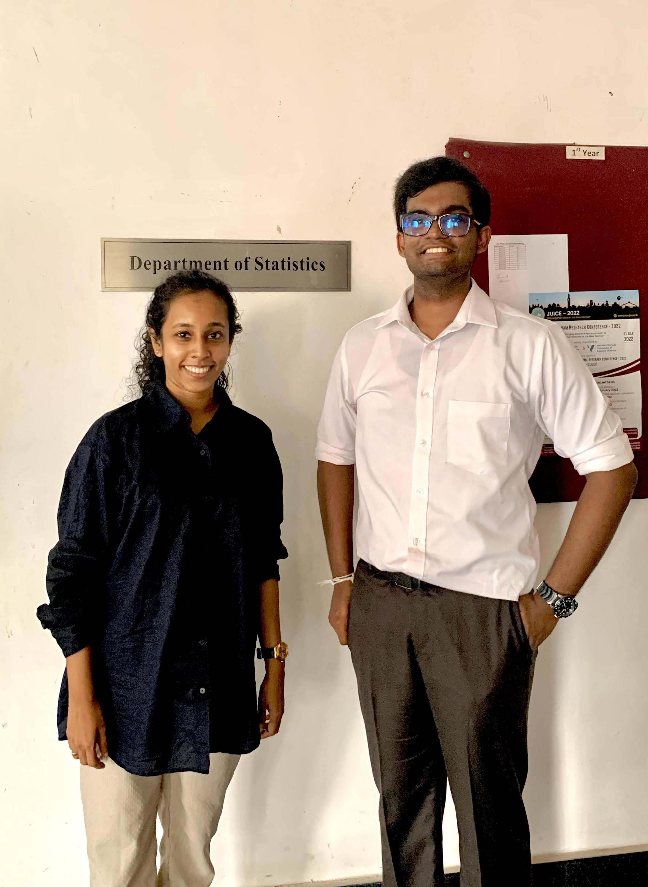
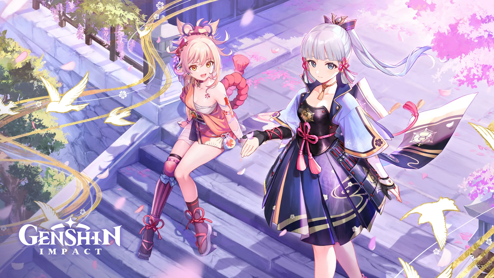
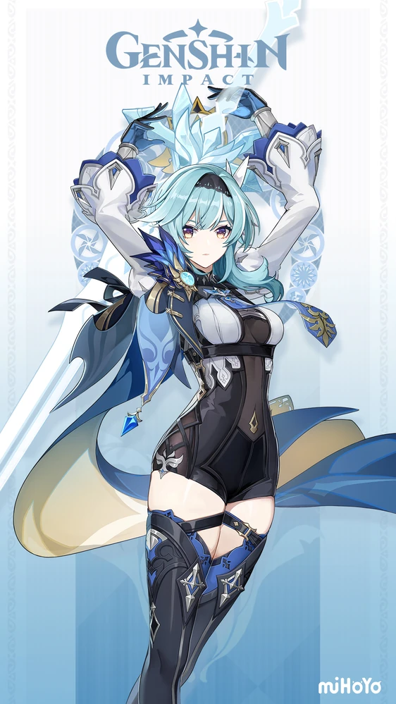
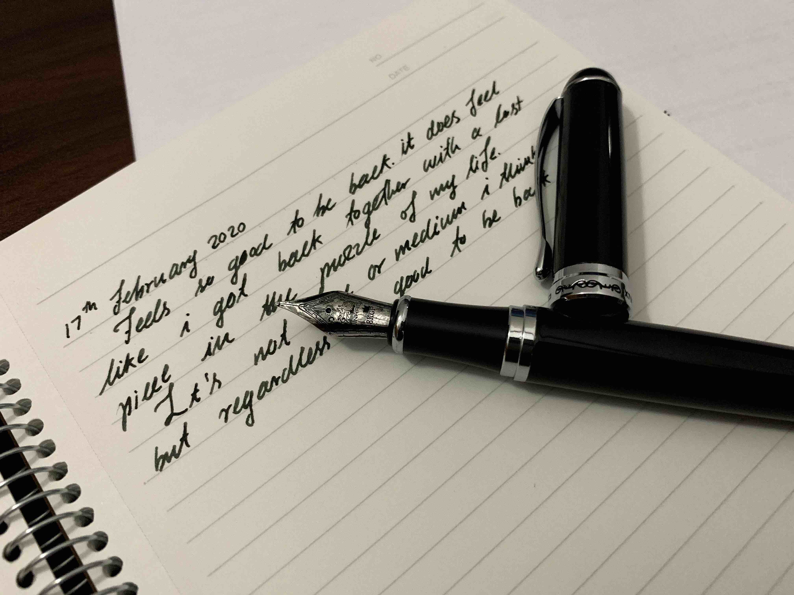

 

Hi there, I’m Janith Wanniarachchi, an R Shiny Developer at Appsilon and a First Class graduate in BSc. in Statistics (Hons.) degree from the University of Sri Jayewardenepura, Sri Lanka.

My research interests are mainly in data visualization, time series forecasting, bayesian inference and interpretable machine learning. My interest for interpretable machine learning began with my final year research project, titled "Transparency, auditability and explainability of interpretable machine learning methods". The research project wouldn't have been a success if not for the guidance and supervision of [Dr. Thiyanga Talagala](https://thiyanga.netlify.app/). From the very first datathon that she mentored me in, she has been an inspirational character in my university life, pushing me to think out of the box and find novel solutions to problems.

In addition, the lecturers of the department of statistics has been super helpful in nurturing my knowledge of statistics and providing me the opportunity to explore new avenues in applying statistics. 

On this website you will find some of my work and interests in statistics and creative writing. If you find anything out of place or worth mentioning to me, please contact me through my socials. If you want to learn more about my academic and professional background, check out my Resume below. 

<a href="https://www.twitter.com/janithcwanni" class="socials">Twitter</a>

<a href="https://www.github.com/janithwanni" class="socials">Github</a>

<a href="https://www.linkedin.com/in/janith-wanniarachchi" class="socials">Linkedin</a>

<a href="mailto:janithcwanni@gmail.com" class="socials">Email</a>

<a href="Janith_Wanniarachchi_Portfolio.pdf" class="socials">Resume</a>

 

With that being said, here are some of my interests that I don't get to talk about a lot. 

# My current obsessions

## Genshin Impact

Genshin Impact is a video game that I have been playing for almost an year now. The main things I love about the game are the stunning visuals, the art style and the music along with the gripping and creative story line. Since it's mostly a single player game, I can play without any pressure of internet speed or skill level. My most favorite character of all is Eula, and these days I'm bulding up two other favorite characters, Candace and Shikanoin Heizou. 

## Fountain pens and Notebooks

My love for fountain pens began with my obsession with calligraphy and cursive writing. From the early days I have collected several starter level fountain pens, listed in chronoligcal order as follows.

1. Hero Fountain Pen
2. TWSBI Eco pen
3. Parker Vector
4. Jinhao X750
5. Jinhao X550

Currently, I'm still using Noodler's Bernanke Black as my primary ink and Daycraft dotted notebook as my paper medium. Here are some snaps of the various pens and notebooks that I have used upto now.

