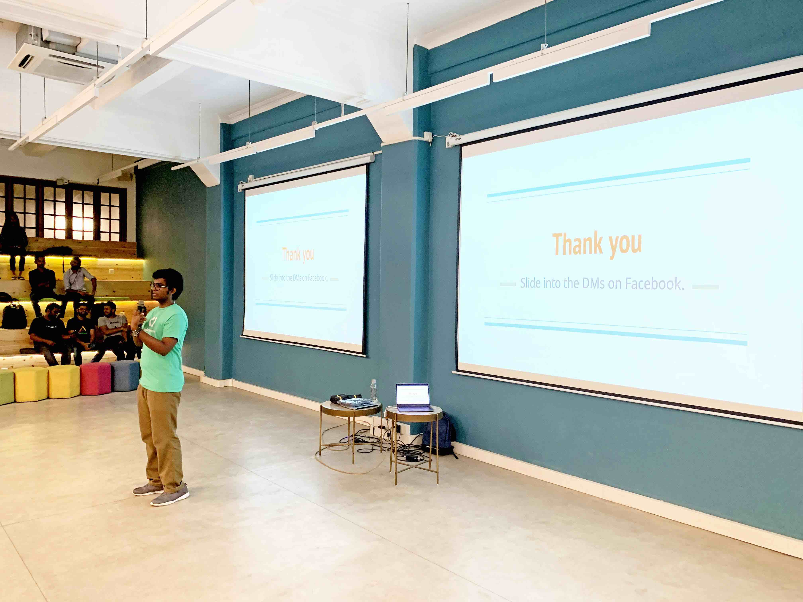
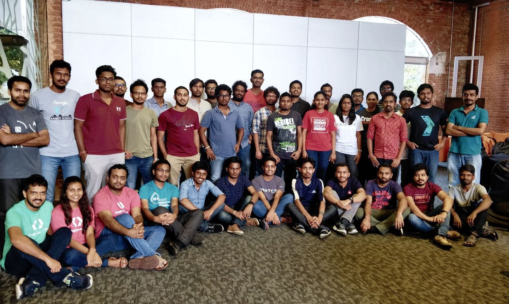

I love sharing my knowledge with others, be it through tutoring sessions for my colleagues or a talk for a crowd of enthusiasts. These are some of the places where I got the opportunity to share my knowledge publicly.

## Abuja useR Group September 2022 meetup

 

Dr. Stephen Balogun was my coordinator for the useR! 2022 conference and after the conference, I received an invite to speak with the Abuja R user group on September 2022. The topic that I chose for the talk was based on a recent technical assessment I had performed where I had to learn the techniques and intricacies of creating an interactive map within a Shiny dashboard. Since knowledge is best retained when shared, I decided to do a session on implementing leaflet maps in Shiny dashboards.

[Slides](https://abuja-use-r-september-2022-leaflet.netlify.app/#/) 
[Shiny application](https://janithwanni.shinyapps.io/abuja-bird-watcher/)

## RLadiesColombo April 2021 meetup

The RLadies initiative interested me from the beginning when I was introduced to it on the very first lecture with Dr. Thiyanga Talagala. Even though I was scared to engage with the community as my initial thought was that I would not be welcome there, I joined my first RLadies meetup with the Plot a lot with ggplot2 workshop done by Priyanga and Thiyanga Talagala. After a few months, I myself received the opportunity to present my knowledge on Data Wrangling in R at the April Meetup of RLadies Colombo. 

The idea that I wanted to follow in this session was to stray away from the standard workshop format of introducing several functions in a specific package and instead wanted to give a real life scenario where these functions will be used. I had a firm belief that people tend to learn things when they use it in a practical context that means something to them. Hence I used the idea of asking the audience to imagine that they are an intern at Spotify and that they are assigned different tasks that require the specific use of a data wrangling function in the dplyr,tidyr and lubridate packages.

<blockquote class="twitter-tweet">
<a href="https://twitter.com/RLadiesColombo?ref_src=twsrc%5Etfw">@RLadiesColombo</a> just finished another fantastic meetup session. Thank you <a href="https://twitter.com/janithcwanni?ref_src=twsrc%5Etfw">@janithcwanni</a> for that awesome session on Data wrangling with R 👏👏👏🎉. <a href="https://twitter.com/hashtag/rstats?src=hash&amp;ref_src=twsrc%5Etfw">#rstats</a> <a href="https://twitter.com/hashtag/DataWrangling?src=hash&amp;ref_src=twsrc%5Etfw">#DataWrangling</a> <a href="https://twitter.com/hashtag/DataScience?src=hash&amp;ref_src=twsrc%5Etfw">#DataScience</a> <a href="https://twitter.com/hashtag/rladies?src=hash&amp;ref_src=twsrc%5Etfw">#rladies</a> Janith&#39;s slides here: <a href="https://t.co/kuaCX3ca95">https://t.co/kuaCX3ca95</a> <a href="https://t.co/X2p0yhc4VG">pic.twitter.com/X2p0yhc4VG</a>
&mdash; R-Ladies Colombo (@RLadiesColombo) <a href="https://twitter.com/RLadiesColombo/status/1385213026333122562?ref_src=twsrc%5Etfw">April 22, 2021</a></blockquote>  

[Slides](https://www.rladies-colombo-april-2021.netlify.app)

## Tensorflow All Around 2019

Tensorflow All Around was an event organized by the Tensorflow User Group of Sri Lanka parallel to similar events organized all through out the globe. I was the head of the Tensorflow User Group of Sri Lanka during this period and I took the initiative to organize the event and presented a talk on using Tensorflow.js for sentiment analysis on the browser. There were over 30 participants who followed along with the talk by trying out the different components of setting up Tensorflow.js on a webpage and classifying sentiment of text collected through an API call with the help of a Universal Sentence Encoder. 

   

[Github](https://github.com/janithwanni/tf-all-around-2019)
[Slides](https://docs.google.com/presentation/d/1qObKc5AxoqTHx6lbgusqUdAaXmRzyxnf8R3lDxHzplQ/edit?usp=sharing)

## Google Developer Group ML Bootcamp 2019

This was my first talk in the Google Developer Group in Sri Lanka, where I was helping out a two day bootcamp by providing two sessions. One session was in helping the audience understand loss functions and the other session was on RNNs for sequential data. The audience consisted of many professionals in the Software industry and they were quite enthusiastic on using the concepts that were taught during the sessions. Both sessions were conducted using Python and Tensorflow.

<blockquote class="twitter-tweet">
Machine Learning Bootcamp is happening on the 23rd and 24th February organized by <a href="https://twitter.com/GDGLK?ref_src=twsrc%5Etfw">@GDGLK</a> and <a href="https://twitter.com/SLASSCOM?ref_src=twsrc%5Etfw">@SLASSCOM</a> Technology Forum at <a href="https://twitter.com/wso2?ref_src=twsrc%5Etfw">@wso2</a> Trace Expert City office, Sri Lanka. Register from the link below <a href="https://t.co/RyB0wjNeFN">https://t.co/RyB0wjNeFN</a><a href="https://twitter.com/hashtag/MachineLearning?src=hash&amp;ref_src=twsrc%5Etfw">#MachineLearning</a> <a href="https://twitter.com/hashtag/cloudstudyjams19?src=hash&amp;ref_src=twsrc%5Etfw">#cloudstudyjams19</a> <a href="https://twitter.com/hashtag/GoogleCloud?src=hash&amp;ref_src=twsrc%5Etfw">#GoogleCloud</a> <a href="https://twitter.com/hashtag/lka?src=hash&amp;ref_src=twsrc%5Etfw">#lka</a> <a href="https://t.co/JKd6iTrJXM">pic.twitter.com/JKd6iTrJXM</a>
&mdash; Shafraz Rahim 🇱🇰 (@shafjag) <a href="https://twitter.com/shafjag/status/1096979558501310464?ref_src=twsrc%5Etfw">February 17, 2019</a></blockquote>  

[Github](https://github.com/rhperera/ml-bootcamp-2019)

**Day 1 Resources**
[Day 1 Regularization](https://docs.google.com/presentation/d/12GasOFWxFgj-LDSKfAX0QV3HmyU3-uW9k1Q60otpcoQ/edit?usp=sharing)
[Day 1 Loss functions](https://docs.google.com/presentation/d/1yRD8ItYIp4YeKjWIiMydMfB1FrLCotTQ4jYW_IOyEAI/edit?usp=sharing)

**Day 2 Resources**
[Day 2 RNN](https://docs.google.com/presentation/d/1P9W2NsCOwzMCbl00tlq2oXkl0YGy-3HK0Y-oECMJ8t8/edit?usp=sharing)

## Octave Thesis Presentation

The Octave Advanced Analytics Symposium, organized a research competition where undergraduates and postgraduates submitted the abstract of their thesis and the finalists recieved the opportunity to showcase their thesis to a panel of judges. I was able to secure the position of top 10 finalist in the competition based on the abstract of my thesis.

<blockquote class="twitter-tweet">
My student <a href="https://twitter.com/janithcwanni?ref_src=twsrc%5Etfw">@janithcwanni</a> is presenting our work on Transparency, Auditability and Explainability of Machine Learning Interpretability Methods. Congratulations on becoming a finalist in the OCTAVE research competition  Check out his work at: <a href="https://t.co/aNlFLNAjWI">https://t.co/aNlFLNAjWI</a> <a href="https://t.co/bJRDa3tm8H">pic.twitter.com/bJRDa3tm8H</a>
&mdash; Thiyanga Talagala (@thiyangt) <a href="https://twitter.com/thiyangt/status/1525039843792789504?ref_src=twsrc%5Etfw">May 13, 2022</a></blockquote> 

[Slides](https://www.janiths-octave-thesis-presentation.netlify.app)
[Recording](https://drive.google.com/file/d/1pdUgGgjd9fzLDWxpKgz2TQpd1guF69dU/view?usp=sharing)

## RETRO Paper reading presentation

During my time working as a contractor consultant for labml.ai, I was priviledged to record and upload a paper reading session on the paper on the RETRO model,a large language model developed by Deepmind. The core conceptof the paper was summarized and contained within a short video for researchers to watch and gain a highlevel idea of the inner workings of the RETRO model.

[Paper](https://papers.labml.ai/paper/324a7d2e589111ec905035ac8856fc87)
[Recording](https://www.youtube.com/watch?v=9XFka0kY4_k)

## EDEX presentation on Sports Analytics on Netball

As an initiave of the Sports Analytics Unit of University of Sri Jayewardenepura, a data entry application was to be built for the Sri Lankan Netball team. In this project I built the data entry application using R Shiny and a Microsoft Azure SQL database. The architecture and the thought process behind the app development was shared in EDEX, an annual higher studies exhibition organized by the Royal College Union. 

<iframe src="https://www.facebook.com/plugins/video.php?height=476&href=https%3A%2F%2Fwww.facebook.com%2FEdexExpo%2Fvideos%2F380566463887126%2F&show_text=false&width=267&t=0" width="267" height="476" style="border:none;overflow:hidden" scrolling="no" frameborder="0" allowfullscreen="true" allow="autoplay; clipboard-write; encrypted-media; picture-in-picture; web-share" allowFullScreen="true"></iframe>

[Facebook Video](https://www.facebook.com/EdexExpo/videos/380566463887126/)
[Slide](https://docs.google.com/presentation/d/12pENsQKbmH35r1uGS7QY_ZX3cHps43bCmcQN6U7Ka9c/edit?usp=sharing)

## Fundamentals of Data Visualization

During my time as the President of the Statistics Society, I decided to initiate a data visualization competition called Pearl Viz. The inspiration for the name came from Iron Viz, the annual data visualization competition organized by Tableau and since Sri Lanka is known as the Pearl of the Indian Ocean. Data visualization is a skill that most statistics undergraduates obtain in their first year in the university. However, the tools that were used for data visualization in the classroom was limited by their performance and sharing capabilities. Therefore new visualization technologies should be introduced if the students were to take on the task of providing visualizations using modern Business Intelligence tools. To introduce students to these tools along with the Do's and Dont's of data visualization, I organized a short webinar on the Fundamentals of Data Visualization. As a live demo I took a wireframe sketch of a dashboard based on the career of the popular pop artist P!nk and turned it into a shareable interactive web based dashboard using Google Data Studio.

[Slides](https://docs.google.com/presentation/d/19v6ngh-fiVCoybVemLfqg01a4bsVgnrIwiVq7gWEYxs/edit?usp=sharing)
[Recording](https://drive.google.com/file/d/12F4PWhfx4YhlFRHKNUekjyegtscpFdtg/view?usp=sharing)

## Data Visualization in Tableau

As the next step of preparing students to modern BI tools, I decided to give a small tutorial on Tableau, specifically Tableau Public and Tableau Cloud, two free data visualization tools that undergraduates can use to learn and enhance their skills to be better prepared for the industry. In this instance a live demo was done using the starter demo dataset from Tableau on the amount of $\text{CO}_2$ emmisions while another live demo was done using an movie profit and review dataset.

[Slides](https://docs.google.com/presentation/d/1J8w4TxAVanPy7j0NuhyZaYCfq8GnGnPq3O7clczRrso/edit?usp=sharing)
[Recording](https://drive.google.com/file/d/1J6O4U39zx7q32TTpXpxNvCSxXN3ULoyQ/view?usp=drivesdk)